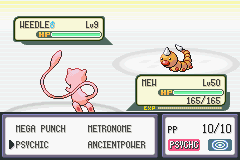
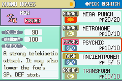
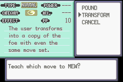
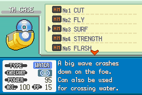

### Split Icons

This repository is a combination of small routines which shows the category icon for a move under the Physical Special Split in relevant UIs: the TM Case's info section, the Move Relearner's UI, a Pokémon's move summary screen, and in battle.

#### Assumptions this hack makes

Obviously, this hack assumes that you have inserted [the Physical-Special-Status split](https://www.pokecommunity.com/showthread.php?t=352721), and set the category for each move.

#### Updating the types image and table

Update your ROM's types image to have the new icons in the `gfx.png` image file.

You can compare it with `gfx_original.png` to see what has been added.

You can overwrite the image at the following address with a tool such as GBA Graphics Editor.

Types image graphics address: `0xE95DDC`

Types image palette address: `0xE95DBC`

Provided you do not make the new file any larger, repointing of the image will not be necessary.

Update your ROM's types image table to support the new icons.

Types image table address: `0x452C94`

Assuming your types image exactly matches `gfx.png`, you can simply insert `type_table.bin` into your ROM and repoint from `0x452C94` to wherever you insert it.

For more complex adjustments to the types image and its table, refer to the [PokéCommunity tutorial on adding new types to FireRed](https://www.pokecommunity.com/showthread.php?t=313872) for an indepth explanation of how the table and image are linked.

You may also need to update `CATEGORY_ICONS` in `config.s` to make it match the index for the category icons in your ROM's own table.

#### How do I insert this?

First, open `config.s` in a text editor to customize it.

Tweak the definition of `free_space` to be where you want the code inserted.

Update `move_data` and `move_descriptions` as needed.

This hack also supports [Zeturic's Unhidden Power](https://github.com/Zeturic/unhidden-power).

If wish to enable this support, change `unhidden-power` from `false` to `true` in `config.s`.

Then, set the label `hp_type_decode_addr` to the address (NOT +1) of that routine.

You'll need to have [armips](https://github.com/Kingcom/armips).

Place your ROM in this folder and name it `rom.gba`.

Once you're ready, assemble with `armips split-icons.asm`; it'll generate `test.gba`, which is your output (`rom.gba` will not be modified).
